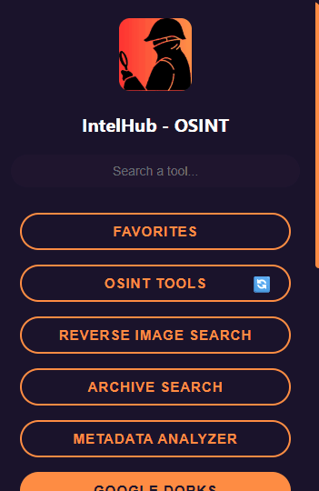
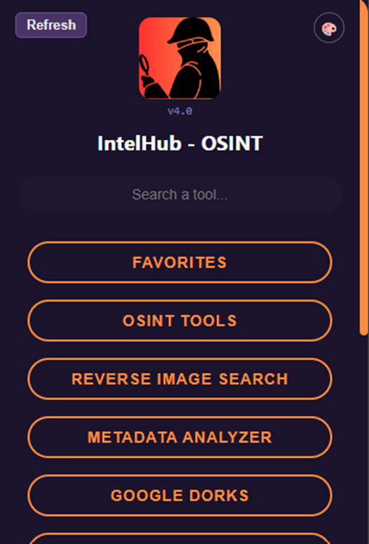
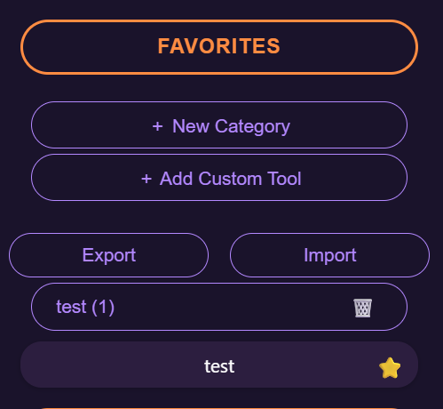
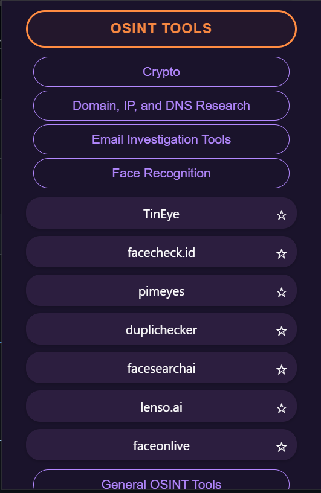
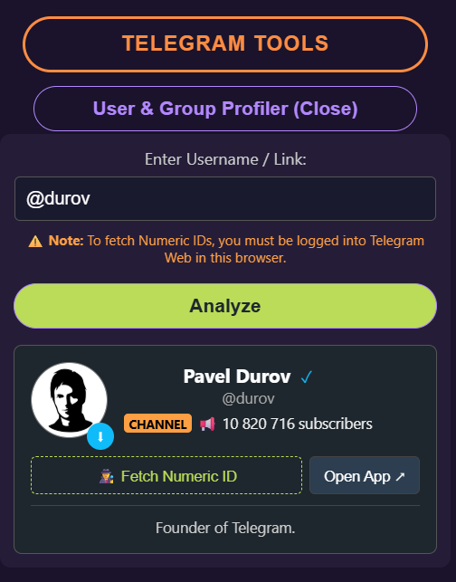
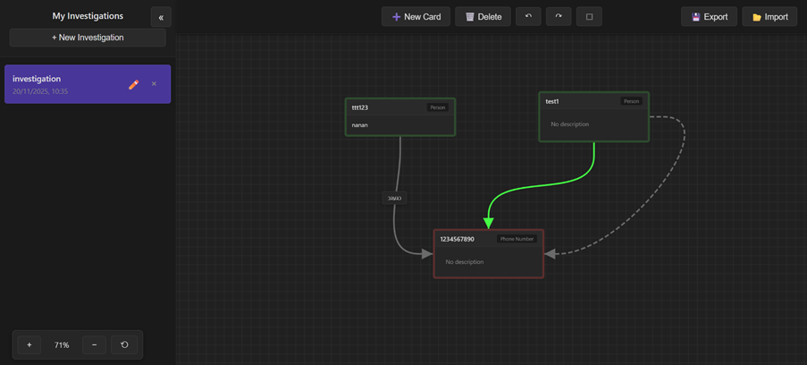
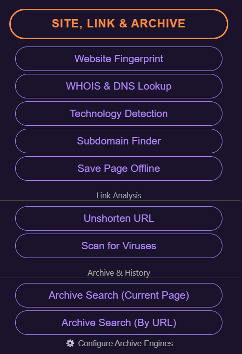
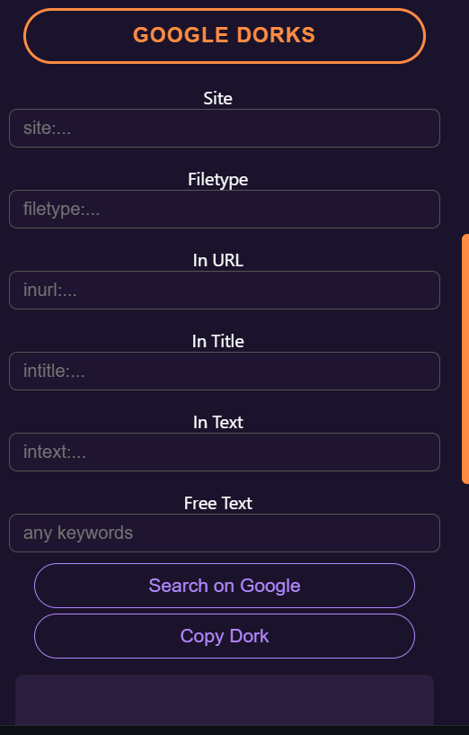
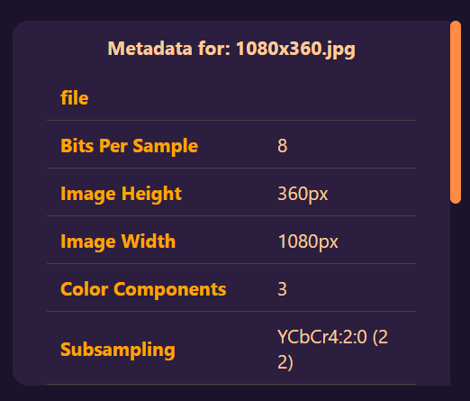
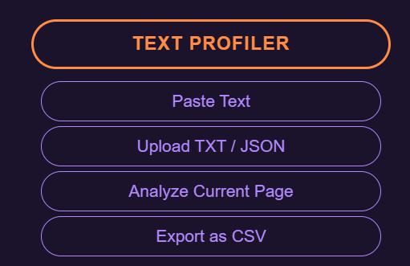

# IntelHub – OSINT Toolkit 🧠

<p align="center">
  
</p>

<p align="center">
  <b>Advanced Browser-Based Intelligence Suite v5.0.1</b>
</p>

<p align="center">
  A comprehensive Open-Source Intelligence (OSINT) suite that transforms your browser into a powerful investigation toolkit. <br>
  Designed for researchers, analysts, and investigators with advanced tools for Telegram analysis, Digital Forensics, and complete privacy protection.
</p>

<p align="center">
  </br></br>
  <a href="https://chromewebstore.google.com/detail/jfjpgfklmjdhabodgghmjclpgnpiejlh">
    <picture>
      <source srcset="https://i.imgur.com/XBIE9pk.png" media="(prefers-color-scheme: dark)">
      </picture></a>
  <a href="https://addons.mozilla.org/en-US/firefox/addon/intelhub/">
    <picture>
      <source srcset="https://i.imgur.com/ZluoP7T.png" media="(prefers-color-scheme: dark)">
      </picture></a>
  <a href="https://microsoftedge.microsoft.com/addons/detail/intelhub/mllimkjdpgenkhlnpmiploclgponggjg">
    <picture>
      <source srcset="https://i.imgur.com/Jog9cQP.png" media="(prefers-color-scheme: dark)">
      </picture></a>
  </br></br>
</p>

---

<p align="center">
  
</p>

## 📚 Documentation / Guides
**Full usage guides are available in the `help` section within the extension or here:**

| 🇺🇸 English | 🇮🇱 Hebrew | 🇪🇸 Spanish | 🇫🇷 French | 🇩🇪 German | 🇧🇷 Portuguese | 🇵🇱 Polish |
|:---:|:---:|:---:|:---:|:---:|:---:|:---:|
| [Link](help/guide_en.md) | [Link](help/guide_he.md) | [Link](help/guide_es.md) | [Link](help/guide_fr.md) | [Link](help/guide_de.md) | [Link](help/guide_pt_br.md) | [Link](help/guide_pl.md) |

---
## ✨ What's New in Version 5.0.1?

**🔒 Secure by Design & Privacy First**
We've completely overhauled the extension's security architecture. V5.0.1 introduces strict Privacy Consent flows for cross-origin tasks, targeted local network sniffing restricted strictly to target domains, and rigorous HTTPS schema validation for all dynamically loaded tools to prevent XSS.

**🤖 Quad-Engine OSINT AI Assistant** 
A groundbreaking update! We've integrated four powerful, privacy-first AI search engines (Google AI, Brave Search, Phind, and Andi) directly into the extension. Run parallel queries and cross-reference intelligence instantly.

**👥 Facial Recognition & Comparison**
New advanced forensic capability! Upload two images to perform local, client-side facial comparison securely within your browser.

**🛡️ File Hash Generator & Validator**
Ensure file integrity with our new offline hashing tool. Generate checksum hashes for any file and compare them instantly to detect tampering.

**🎨 Neon Theme & UI Overhaul**
Introducing a sleek, cyberpunk-inspired Neon theme! Switch between Modern, Classic, and Neon instantly.

**📊 Investigation Graph**
A brand new visualization tool! Map out your investigation entities, connect dots, and create a visual relationship graph directly within the extension.


---

## 📸 Interface Preview

| **Main Interface** | **Favorites & Custom Tools** | **OSINT Tools Repository** |
|:---:|:---:|:---:|
|  |  |  |

| **Telegram Profiler** | **Investigation Graph** | **Site & Archive Recon** |
|:---:|:---:|:---:|
|  |  |  |

| **Google Dorks Builder** | **Metadata Analyzer** | **Text Profiler** |
|:---:|:---:|:---:|
|  |  |  |

---

## 🛠️ Key Features

### 📱 Telegram Intelligence
* **Deep User Profiler:** Fetch details, profile pictures, and bio from usernames.
* **Numeric ID Extraction:** Grab unique Numeric IDs for users, groups, and channels (Web login required).
* **Phone Lookup:** Quick links to check phone number registrations.

### 🌐 Site, Link & Archive Recon
* **Digital Fingerprint:** Identify tech stacks, cookies, and user-agent data.
* **Safety Checks:** Unshorten URLs and scan them with VirusTotal in one click.
* **Time Travel:** Search for historical versions of any site across Wayback Machine, Archive.today, and more.
* **Offline Evidence:** Save a perfect local HTML snapshot of any webpage.

### 🖼️ Media & Metadata
* **Reverse Image Search:** Upload or paste any image to search for it across Google, Yandex, Bing, and TinEye simultaneously.
* **Metadata (EXIF) Viewer:** Extract hidden data from Images, PDFs, and Office documents locally.

### 📝 Text & Social Analysis
* **Text Profiler:** Automatically extract emails, crypto addresses, and phone numbers from any text block.
* **Social ID Extractor:** One-click extraction of numeric IDs from Facebook and other social platforms.

### ⚡ Productivity
* **Favorites System:** Save your most-used tools. Create custom categories and add your own external tools.
* **Import/Export:** Backup your configuration and share it with other analysts.
* **Google Dorks Builder:** Construct complex search queries with a simple UI.

---

## ✅ System Requirements

To use this extension, you'll need:

- **Browser**: Chrome, Firefox, Opera, Edge, or any Chromium-based browser 🖥️
- **Storage**: Minimal – used only to save preferences and favorites 📦
- **Internet Access**: Required for launching online OSINT tools 🌐
- **Permissions**:
  - `storage` – Save favorites and preferences
  - `scripting` – Inject scripts into active tab (for ID extraction)
  - `tabs` – Get information about the current tab
  - `clipboardRead` – Allow pasting images from clipboard
  - `downloads` – Save snapshots and exported files
  - `activeTab` – Interact with the current tab when needed

---

## 📦 Project Structure

```text
IntelHub/
├── manifest.json
├── popup.html
├── popup.js
├── content.js
├── README.md
├── help/
│   ├── guide_en.md
│   ├── guide_he.md
│   └── images/
├── styles/
│   ├── styles.css
│   └── styles_old.css
├── modules/
│   ├── osintTools.js
│   ├── favorites.js
│   ├── telegramAnalyzer.js
│   ├── siteAnalyzer.js
│   ├── investigationGraph.js
│   ├── help.js
│   ├── utils.js
│   └── ...
├── libs/
│   ├── cytoscape.min.js
│   ├── chart.min.js
│   ├── ExifReader.js
│   ├── pdf-lib.min.js
│   └── ...
└── icons/

```
---

## 🔒 Privacy Policy
* **Local Execution:** All scripts and forensic analyzers (like EXIF reading and hashing) run purely within your browser (Client-Side).
* **No Tracking:** We do not collect analytics, telemetry, or user data. Your investigation stays on your machine.
* **Explicit User Consent:** Features requiring cross-origin requests (such as URL Unshortening or Reverse Image Search) enforce an interactive privacy consent checkpoint before execution.
* **Strict Network Scoping:** Network sniffing tools (like the Google ID extractor) are strictly scoped to their target domains (e.g., Google APIs) and self-terminate automatically to prevent data leakage.
* **Secure Remote Fetching:** External OSINT tools fetched from GitHub are strictly verified through schema validation and HTTPS enforcement to neutralize XSS risks.

---

## 🤝 Credits & Libraries

This project makes use of the following open-source libraries:

- **[Compromise NLP](https://github.com/spencermountain/compromise)**: For text entity extraction.
- **[ExifReader](https://github.com/mattiasw/ExifReader)**: For parsing image metadata.
- **[pdf-lib](https://github.com/Hopding/pdf-lib)**: For PDF metadata analysis.
- **[jszip](https://github.com/Stuk/jszip)**: For handling Office documents.
- **[SingleFile](https://github.com/gildas-lormeau/SingleFile)**: For saving offline webpages.
- **[psl](https://github.com/lupomontero/psl)**: For parsing domain names.
- **[Chart.js](https://github.com/chartjs/Chart.js)** & **[Cytoscape.js](https://github.com/cytoscape/cytoscape.js)**: For data visualization and graphs.
- **[date-fns](https://github.com/date-fns/date-fns)**: For date manipulation.

### APIs Used
- **[Unshorten.me](https://unshorten.me)** – Resolving shortened URLs.
- **[corsproxy.io](https://corsproxy.io)** – Handling CORS for external requests.
- **[VirusTotal](https://www.virustotal.com/)** – Domain safety scanning.

> © All APIs and services belong to their respective owners.

---

## Maintainer 👨‍💻

Built with care by **[TomSec8](https://github.com/tomsec8)**.
Pull requests, issues, and suggestions are welcome!

---

## License 📜

This project is licensed under the **MIT License** – see the [LICENSE](LICENSE) file for details.
