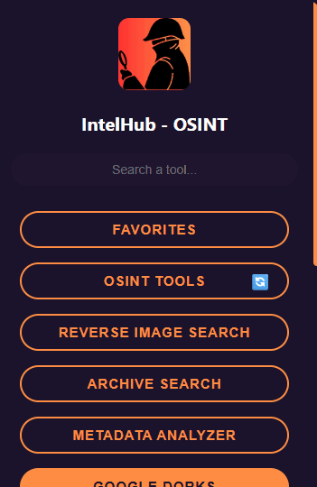
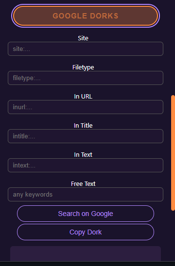

# IntelHub – OSINT Toolkit 🧠

<p align="center">
  
</p>
<p align="center">
  
</p>

A comprehensive Open-Source Intelligence (OSINT) suite that transforms your browser into a powerful investigation toolkit. Designed for researchers, analysts, and investigators with advanced tools for cryptocurrency analysis, Telegram intelligence, and complete privacy protection.

<p align="center">
  </br></br>
  <a href="https://chromewebstore.google.com/detail/jfjpgfklmjdhabodgghmjclpgnpiejlh">
    <picture>
      <source srcset="https://i.imgur.com/XBIE9pk.png" media="(prefers-color-scheme: dark)">
      </picture></a>
  <a href="https://addons.mozilla.org/en-US/firefox/addon/intelhub/">
    <picture>
      <source srcset="https://i.imgur.com/ZluoP7T.png" media="(prefers-color-scheme: dark)">
      </picture></a>
  <a href="https://microsoftedge.microsoft.com/addons/detail/intelhub/mllimkjdpgenkhlnpmiploclgponggjg">
    <picture>
      <source srcset="https://i.imgur.com/Jog9cQP.png" media="(prefers-color-scheme: dark)">
      </picture></a>
  <a href="#opera-addon-link">
    <picture>
      <source srcset="https://i.imgur.com/ziehy0f.png" media="(prefers-color-scheme: dark)">
      </picture></a>
  </br></br>
</p></p>

---

## IntelHub 3.0.1: Your All-in-One OSINT Toolbox 🚀

IntelHub 3.0.1 transforms your browser into a powerful, comprehensive Open-Source Intelligence (OSINT) suite. Designed for researchers, analysts, and investigators, this major update introduces advanced tools for cryptocurrency and Telegram analysis, alongside significant workflow enhancements.

**All processing is done locally on your machine, ensuring your investigations remain completely private and secure.**

---

## What's New in Version 3.0.1? ✨

🚀 **Crypto Wallet Analyzer**: A brand-new, powerful module for analyzing Bitcoin and Ethereum wallets. Perform quick lookups directly from the extension, or launch the advanced analyzer to visualize transaction networks, assess risk, and uncover detailed blockchain data.

🕵️‍♂️ **Dedicated Telegram Tools**: Instantly check if a phone number is registered on Telegram. Dive deep into chat history by uploading JSON exports to our new "Funstat Bot Analyzer" to extract insights, statistics, and critical intelligence.

⚙️ **Custom Tools & Backup**: You can now add your own custom tools to your favorites list. Never lose your personalized setup with the new Import/Export feature, allowing you to back up and share your favorite tools.

---

## Screenshots 📸

| Main Menu | Welcome Screen | OSINT Tools |
|-----------|----------------|--------------|
|  |  |  |

| Social Tools | Text Profiler | Metadata Analyzer |
|--------------|----------------|--------------------|
|  |  |  |

---

## Key Features 🛠️

### Cryptocurrency & Social Media Intelligence

**Crypto Wallet Analyzer**: Investigate BTC and ETH addresses. The advanced tool provides transaction history, risk analysis, related addresses, and a visual network graph to map out fund flows.

**Telegram Tools**: Look up phone numbers on Telegram and perform in-depth analysis of chat data exports to understand activity patterns, identify key entities, and more.

**Social Identifier Extractor**: Extracts user IDs from various social media profile pages to aid in cross-platform analysis.

### Deep Content Analysis

**Text Profiler**: Automatically extracts valuable identifiers from any text, including emails, phone numbers, crypto wallets, domains, and social media profiles.

**Metadata Analyzer**: Uncovers hidden metadata from uploaded images, PDFs, and Office documents directly on your device.

### Website & Domain Intelligence

**Site Analyzer**: Provides a comprehensive overview of any website, including its technology stack, WHOIS information, and digital fingerprint. Includes an option to save a complete, offline snapshot of any page.

**Archive Search**: Instantly checks for historical versions of a webpage across various archive services.

### Powerful Utility Tools

**Reverse Image Search**: Upload or paste any image to search for it across multiple leading search engines.

**Link Analyzer**: Expands shortened URLs to reveal their final destination and provides quick access to security scans.

### Efficient Workflow

**Curated & Custom Tool Library**: Quick access to a categorized list of essential online OSINT tools, now with the ability to add your own tools to a persistent favorites list.

**Import/Export**: Back up and restore your personalized list of favorite tools at any time.

**User-Friendly Interface**: A clean, dark-mode interface with robust search functionality to help you work faster.

---

## Privacy First: Your Work Stays Yours 🔒

IntelHub performs all its analysis locally on your computer. **No data is ever sent to or stored on our servers.** Your investigations are yours alone.

Whether you're a cybersecurity professional, journalist, researcher, or OSINT enthusiast, IntelHub 3.0.1 provides the critical tools you need to turn open data into actionable intelligence.

---

## System Requirements ✅

To use this extension, you'll need:

- **Browser**: Chrome, Firefox, Opera, Edge, or any Chromium-based browser 🖥️
- **Storage**: Minimal – used only to save preferences and favorites 📦
- **Internet Access**: Required for launching online OSINT tools 🌐
- **Permissions**:
  - `storage` – Save favorites and preferences
  - `scripting` – Inject scripts into active tab
  - `tabs` – Get information about the current tab
  - `clipboardRead` – Allow pasting images from clipboard (for Reverse Image Search)
  - `downloads` – Save snapshots and exported files
  - `activeTab` – Interact with the current tab when needed

---

## Installation 🚀

### From Browser Stores (Recommended)

Choose your browser and click the install button above to get IntelHub from your browser's official store.

### Manual Installation (Development)

You can also load the extension manually during development:

```bash
git clone https://github.com/tomsec8/IntelHub.git
```

1. Open your browser's extensions page:
   - Chrome: `chrome://extensions/`
   - Firefox: `about:addons`
   - Edge: `edge://extensions/`
   - Opera: `opera://extensions/`
2. Enable **Developer mode** (usually in the top-right corner)
3. Click **"Load unpacked"** and select the `IntelHub` folder

---

## Project Structure 📦

```
IntelHub/
├── content.js
├── manifest.json
├── popup.html
├── popup.js
├── firefox/
│   ├── import-favorites.html
│   ├── import-favorites.js
│   ├── metadata-upload.html
│   ├── metadata-upload.js
│   ├── reverse-image-upload.html
│   ├── reverse-image-upload.js
│   ├── text-profiler-upload.html
│   └── text-profiler-upload.js
├── icons/
│   └── icon.png
├── libs/
│   ├── chart.min.js
│   ├── cytoscape.min.js
│   ├── date-fns.min.js
│   ├── ExifReader.js
│   ├── jszip.min.js
│   ├── pdf-lib.min.js
│   ├── psl.min.js
│   └── single-file.js
├── modules/
│   ├── archiveSearch.js
│   ├── cryptoAnalyzer.js
│   ├── dorks.js
│   ├── favorites.js
│   ├── help.js
│   ├── linkAnalyzer.js
│   ├── metadataAnalyzer.js
│   ├── osintTools.js
│   ├── reverseImageSearch.js
│   ├── siteAnalyzer.js
│   ├── socialIdExtractor.js
│   ├── telegramAnalyzer.js
│   ├── textProfiler.js
│   ├── utils.js
│   ├── cryptoAnalyzer/
│   │   ├── cryptoAnalyzer.html
│   │   ├── css/
│   │   │   └── style.css
│   │   └── js/
│   │       └── main.js
│   └── telegramAnalyzer/
│       ├── analyzer.html
│       ├── css/
│       │   └── style.css
│       └── js/
│           └── script.js
└── styles/
    └── styles.css
```

---

## Maintainer 👨‍💻

Built with care by **TomSec8**  
Pull requests and suggestions are welcome!

---

## Credits 🤝

- **Text Entity Extraction**: [Compromise NLP](https://github.com/spencermountain/compromise)
- **EXIF Parser**: [ExifReader](https://github.com/mattiasw/ExifReader)
- **PDF Parsing**: [pdf-lib](https://github.com/Hopding/pdf-lib)
- **ZIP Handling**: [jszip](https://github.com/Stuk/jszip)
- **Website Snapshot**: [single-file](https://github.com/gildas-lormeau/SingleFile)
- **TLD Parsing**: [psl](https://github.com/lupomontero/psl)
- **Data Visualization**: [Chart.js](https://github.com/chartjs/Chart.js) & [Cytoscape.js](https://github.com/cytoscape/cytoscape.js)
- **Date Utilities**: [date-fns](https://github.com/date-fns/date-fns)
- **Store Badges Design**: Inspired by [Search by Image](https://github.com/dessant/search-by-image) project

### APIs 🌐
- **[Unshorten.me](https://unshorten.me)** – Used to resolve shortened URLs into their original form
- **[corsproxy.io](https://corsproxy.io)** – CORS proxy service that enables secure access to blockchain APIs from browser extensions
- **[Blockchain.info API](https://blockchain.info)** – Public API service providing comprehensive Bitcoin wallet and transaction data
- **[Blockscout API](https://eth.blockscout.com)** – Ethereum blockchain explorer API for ETH wallet analysis and token transaction history
- **[ScamSniffer Database](https://github.com/scamsniffer/scam-database)** – Community-maintained database of known fraudulent crypto addresses for risk assessment
  
  > © All APIs and services belong to their respective owners.

---

*All trademarks, logos, and brand names are the property of their respective owners.*

---

## License 📜

This project is licensed under the **MIT License** – see the [LICENSE](LICENSE) file for details.
