# Benutzerhandbuch - IntelHub 🕵️

Willkommen bei IntelHub. Diese Erweiterung bündelt fortschrittliche Open-Source-Intelligence (OSINT) Tools in einer einzigen, komfortablen Oberfläche und ermöglicht es Forschern und Analysten, Operationen schnell und effizient durchzuführen.

---

## 🏠 Übersicht - Hauptoberfläche
Oben links in der Erweiterung finden Sie den Button **Refresh**, um die Tool-Liste und Einstellungen zu aktualisieren.
Darunter befindet sich eine **Suchleiste** (Search Bar), um schnell bestimmte Kategorien oder Tools zu finden.

Auf der rechten Seite befindet sich ein **Scrollbalken**, um zwischen verschiedenen Kategorien zu navigieren. In der oberen rechten Ecke gibt es einen Umschaltknopf, um das **Design** (Theme) zu ändern.

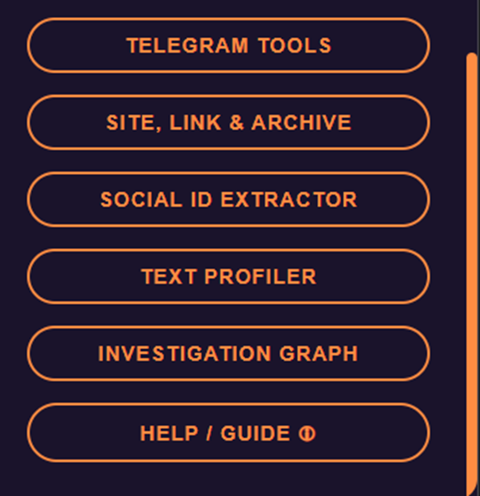

---

## ⭐ Favorites - Favoritenverwaltung
Diese Kategorie zentralisiert Tools, die Sie aus dem allgemeinen Pool als "Favoriten" markiert haben, und ermöglicht das Hinzufügen eigener Tools sowie die Verwaltung von Kategorien.

### Hauptaktionen:
**New Category:** Erstellen Sie neue Ordner/Kategorien, um Ihre Lieblingstools zu organisieren.

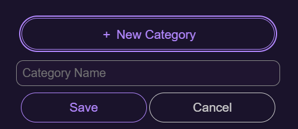

**Add Custom Tool:** Fügen Sie ein externes Tool (das nicht in der Erweiterung enthalten ist) hinzu, indem Sie einen Namen, eine URL und eine kurze Beschreibung eingeben. Sie können das Tool vor dem Speichern einer bestimmten Kategorie zuweisen.

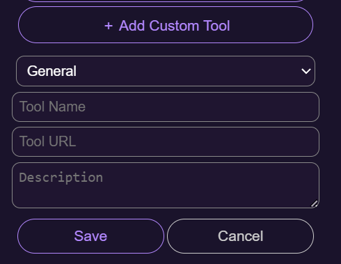

**Export/Import:** Exportieren Sie Ihre Favoritenliste und Einstellungen als Backup-Datei oder importieren Sie sie, um sie an einen anderen Benutzer zu übertragen.

**Laufende Verwaltung:**
So sieht die Tool-Liste nach dem Hinzufügen von Elementen aus.
Um eine Kategorie zu löschen, klicken Sie auf das Papierkorb-Symbol rechts. Um ein Tool aus den Favoriten zu entfernen, klicken Sie auf das Stern-Symbol.

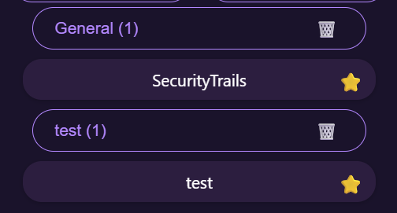

---

## 🛠️ OSINT Tools - Tool-Repository
Diese Kategorie enthält den Kern der Erweiterung - eine umfassende Liste von Intelligence-Tools, unterteilt nach Themen. Die Liste wird automatisch mit dem GitHub-Repository synchronisiert und alle 24 Stunden aktualisiert (oder durch manuelles Aktualisieren).

Ein Klick auf ein Thema (Kategorie) öffnet die Liste der dazugehörigen Tools:

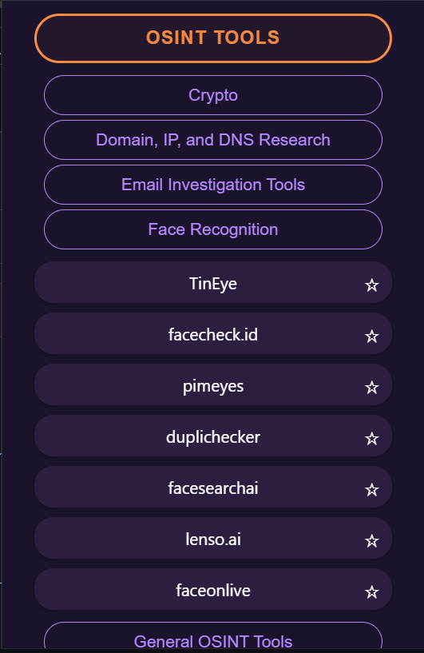

* Ein Klick auf ein Tool öffnet es in einem neuen Tab.
* Ein Klick auf das Stern-Symbol neben einem Toolnamen fügt es zu den "Favoriten" hinzu.
* Wenn Sie mit der Maus über ein Tool fahren, wird eine kurze Beschreibung (Tooltip) seiner Funktion angezeigt.

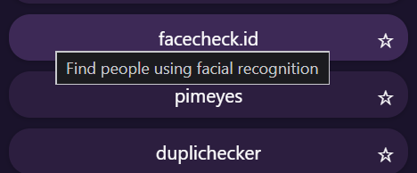

---

## 🖼️ Reverse Image Search - Umgekehrte Bildsuche
Dieses Tool ermöglicht es Ihnen, eine umgekehrte Bildsuche über mehrere Suchmaschinen gleichzeitig durchzuführen.

**Eingabeoptionen:**
1.  **Upload:** Laden Sie eine Bilddatei von Ihrem Computer hoch.
2.  **Paste:** Fügen Sie ein Bild direkt aus der Zwischenablage ein.

*Wählen Sie vor der Suche die Kontrollkästchen der Suchmaschinen aus, die Sie verwenden möchten (Google, Yandex, Bing, TinEye usw.). Ihre Auswahl wird für das nächste Mal gespeichert.*

---

## 📄 Metadata Analyzer - Metadaten-Analyse
Ein Tool zum Extrahieren versteckter Informationen (Metadaten/EXIF) aus Dateien.

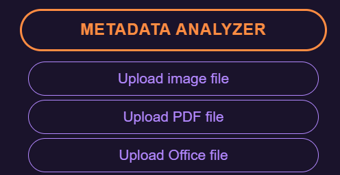

Wählen Sie den gewünschten Dateityp (Bild, PDF oder Office-Dokument) und laden Sie ihn hoch. Der Datenbericht erscheint sofort am unteren Rand des Fensters (scrollen Sie nach unten, um alle Details zu sehen).

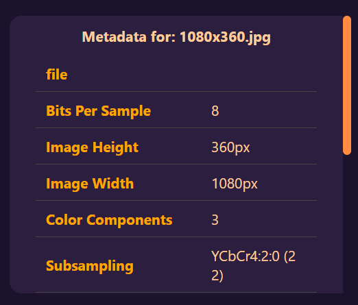

---

## 🔍 Google Dorks - Abfrage-Builder
Eine Oberfläche zum einfachen Erstellen fortgeschrittener Google-Suchanfragen.

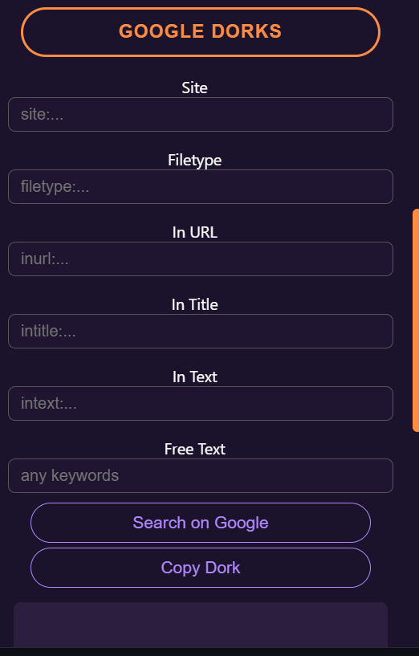

Geben Sie die gewünschten Parameter in die verschiedenen Felder ein (Suche innerhalb einer bestimmten Website, Dateityp, Schlüsselwörter in Titel/URL/Text).
Nachdem Sie die Abfrage erstellt haben, können Sie auf **Search on Google** klicken, um sie sofort auszuführen, oder die Abfragestruktur im Feld unten anzeigen und kopieren.

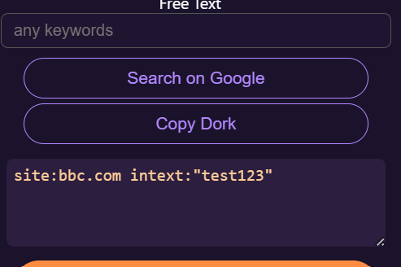

---

## ✈️ Telegram Tools - Telegram-Werkzeuge
Eine Suite von Tools für Telegram-Untersuchungen. Diese Kategorie ermöglicht die Suche nach Telefonnummern, das Sammeln von Benutzer-/Gruppendetails und die Analyse von Exporten.

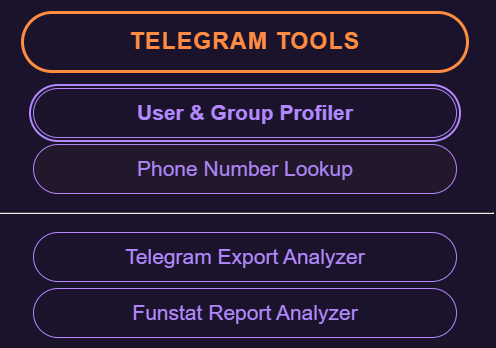

**User & Group Profiler:** Geben Sie einen Benutzernamen (oder Link) ein, um einen Tiefenscan durchzuführen und Benutzerdetails, Profilbild, Status und eine Option zum Abrufen der numerischen ID (**Fetch Numeric ID**) anzuzeigen.

---

## 🌐 Site, Link & Archive - Seitenanalyse
Eine Sammlung von Tools zur Analyse der aktuellen Seite oder einer bestimmten URL für die erste Aufklärung.

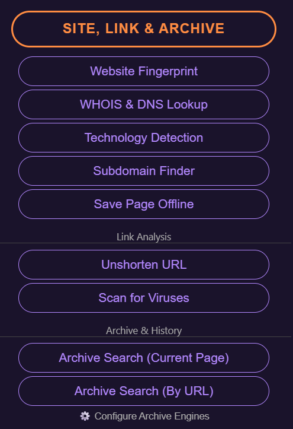

**Verfügbare Tools:**
1.  **Website Fingerprint:** Erfasst den Fingerabdruck der Website (Technologien, Cookies) für Authentizitätsprüfungen.
2.  **WHOIS & DNS:** Überprüft Domain-Eigentum und DNS-Einträge.
3.  **Technology Detection:** Identifiziert den zugrunde liegenden Technologie-Stack.
4.  **Subdomain Finder:** Lokalisiert Subdomains.
5.  **Save Page Offline:** Speichert die aktuelle Seite als lokale HTML-Datei zur Dokumentation.
6.  **Archive Search:** Durchsucht den Verlauf der Website in verschiedenen Webarchiven.

---

## 🆔 Social ID Extractor
Entwickelt, um die **Numerische Benutzer-ID** aus Social-Media-Profilen zu extrahieren oder basierend auf einer vorhandenen ID zu einem Profil zu navigieren.

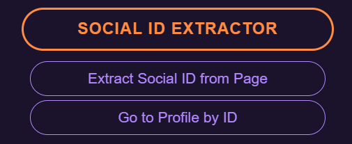

Navigieren Sie zur Profilseite (z. B. auf Facebook) und klicken Sie auf den ersten Button, um die ID zu extrahieren.

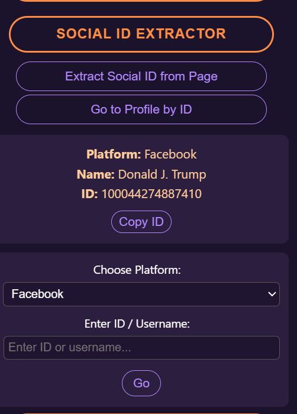

---

## 🔗 Link Analyzer - Link-Analyse
Enthält Tools zur Überprüfung der Sicherheit und Herkunft von Links.

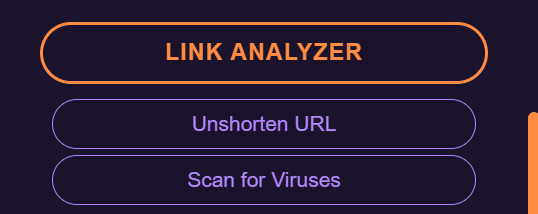

* **Unshorten URL:** Dekodiert verkürzte Links (wie bit.ly), um die ursprüngliche Adresse anzuzeigen.
* **Scan for Viruses:** Überprüft den Link gegen die VirusTotal-Datenbank.

---

## 📝 Text Profiler - Text-Profiler
Scannt und extrahiert **Entitäten** aus Text. Das System identifiziert E-Mails, Krypto-Wallets, Telefonnummern, Benutzernamen und mehr.

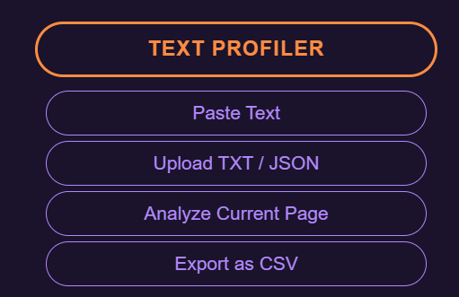

Sie können Text über **Paste** (Einfügen), das Hochladen externer Textdateien oder durch Scannen der **aktuellen Seite** im Browser analysieren. Ergebnisse können als CSV exportiert werden.

---

## 📊 Investigation Graph - Untersuchungsdiagramm
Ein Klick auf diese Kategorie öffnet das Visualisierungssystem.

Mit dem Diagramm können Sie eine Untersuchungskarte erstellen, Entitätskarten hinzufügen und diese verknüpfen, um das Informationsbild klar zu visualisieren.

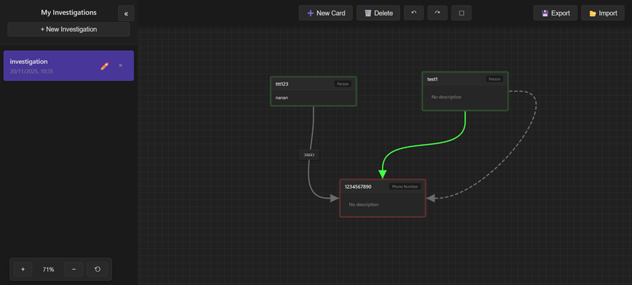
